# Guía de estudio — Framework/Fundamentos de IA (UDD)

Documento de estudio para el examen. Cubre dos capas a propósito:

- **Teoría general** de todo lo que usamos (aplica aunque la pregunta del examen
  no sea sobre *este* proyecto puntual — el examen tiene preguntas al azar de
  cualquier cosa vista en el curso).
- **Aplicación concreta** en este proyecto: arquitecturas exactas,
  hiperparámetros, métricas reales obtenidas, gráficos generados y qué
  conclusión se sacó de cada uno.

Cada vez que aparece un número, es un número **real** sacado de los JSON de
métricas y de `RESULTADOS.md` (no inventado) — así te sirve para responder
"¿qué métrica dio el modelo X?" con precisión.

---

## Índice

1. [Fundamentos teóricos generales](#parte-1--fundamentos-teóricos-generales)
2. [El pipeline de 4 etapas — teoría, implementación, métricas y gráficos](#parte-2--el-pipeline-de-4-etapas)
3. [Preprocesamiento de imágenes y datos sintéticos (OpenCV)](#parte-3--preprocesamiento-de-imágenes-y-datos-sintéticos-opencv)
4. [Arquitectura de la app y servicios usados](#parte-4--arquitectura-de-la-app-mtg-companion-y-servicios-usados)
5. [Glosario rápido](#parte-5--glosario-rápido)

---

## PARTE 1 — Fundamentos teóricos generales

### 1.1 Aprendizaje supervisado: clasificación vs. regresión

Aprendizaje supervisado = tenemos pares `(x, y)` y queremos aprender una
función `f(x) ≈ y`.

- **Clasificación**: `y` es una categoría discreta (binaria o multiclase).
  Ejemplos en este proyecto: "¿es una carta de MTG o no?" (binaria), "¿qué
  condición tiene la carta: NM/LP/MP/HP/DMG?" (multiclase, 5 clases),
  "¿el texto OCR coincide con la carta de referencia?" (binaria).
- **Regresión**: `y` es un valor continuo. Ejemplo: "¿cuánto vale la carta en
  USD?" (Etapa 3).

La diferencia se refleja en tres cosas que cambian juntas: la **última capa**
de la red (1 logit + sigmoide para binaria, N logits + softmax para
multiclase, 1 valor sin activación para regresión), la **función de
pérdida** (BCE, CrossEntropy, MSE respectivamente) y las **métricas** de
evaluación (accuracy/F1/AUC vs. MAE/RMSE/R²).

### 1.2 Transfer learning y fine-tuning

Transfer learning = reusar una red ya entrenada en una tarea grande y
genérica (ImageNet, 1.2M imágenes, 1000 clases) como punto de partida para
una tarea nueva y más chica, en vez de entrenar desde cero.

Dos variantes, ambas usadas en el proyecto:

- **Feature extraction (backbone congelado)**: se usa la red preentrenada
  solo para producir un *embedding* (vector de características), sin tocar
  sus pesos (`requires_grad=False` / `trainable=False`). Es lo que hace la
  **Etapa 3** con el backbone de la Etapa 1: el embedding visual (1280-d en
  PyTorch, 576-d en TensorFlow) se concatena con features tabulares y solo
  se entrena la cabeza nueva (`PriceRegressor`).
- **Fine-tuning parcial**: se descongelan las últimas capas del backbone y
  se re-entrenan junto con la cabeza nueva, mientras las primeras capas
  (features genéricos: bordes, texturas, colores) quedan congeladas. Es lo
  que hacen las **Etapas 1 y 4**: `freeze_ratio` (buscado por Optuna, valor
  ganador 0.65 en ambas) decide qué fracción de los bloques del backbone se
  congela — 0.65 significa congelar el 65% inicial y entrenar el 35% final
  + la cabeza.

**Por qué congelar capas iniciales**: las primeras capas de una CNN
aprenden filtros muy genéricos (bordes, gradientes, texturas) que sirven
para casi cualquier imagen natural — no hace falta reaprenderlos, y
descongelarlos con poco dataset propio arriesga *overfitting* y destruir
pesos ya buenos ("catastrophic forgetting").

**Por qué es la técnica correcta acá**: los datasets propios (miles de
cartas, no millones) son demasiado chicos para entrenar una CNN profunda
desde cero sin overfitting severo. Partir de ImageNet da features visuales
ya útiles (bordes, texturas, formas) gratis.

### 1.3 Arquitecturas de red usadas

**MLP (Multi-Layer Perceptron)** — la arquitectura de cabeza usada en
*todas* las etapas de este proyecto (incluida la "cabeza" de las CNN):
capas `Linear`/`Dense` totalmente conectadas, alternadas con una no
linealidad (ReLU) y `Dropout`. Sin una no linealidad entre capas lineales,
apilar capas sería matemáticamente equivalente a una sola capa lineal (la
composición de transformaciones lineales es lineal) — por eso ReLU es
indispensable, no cosmético.

**CNN (Convolutional Neural Network)** — usada como *backbone* (extractor
de features de imagen) en Etapas 1, 3 y 4:

- **EfficientNet-B0** (backbone PyTorch, Etapas 1 y 4): familia de CNNs de
  Google (2019) que escala profundidad/ancho/resolución de forma
  balanceada ("compound scaling") en vez de escalar un solo eje. B0 es la
  variante más chica de la familia (~5.3M parámetros), buen balance
  precisión/costo para transfer learning. Salida del backbone: 1280
  dimensiones tras global average pooling.
- **MobileNetV3Small** (backbone TensorFlow, Etapas 1 y 4): familia de
  Google diseñada para móviles — usa *depthwise separable convolutions*
  (separa una convolución normal en una depthwise + una pointwise 1×1, muchas
  menos operaciones que una convolución densa equivalente) y *squeeze-and-excite*
  blocks (recalibran canales por importancia). Salida: 576 dimensiones.

Ambos backbones son intercambiables conceptualmente — el proyecto los usa
deliberadamente distintos (uno por framework) para que la comparación
PyTorch-vs-TensorFlow no dependa de compartir arquitectura, sino de qué tan
bien cada framework/backbone resuelve el mismo problema.

**Por qué las dimensiones de salida (1280 vs. 576) importan**: en la Etapa
3, el vector de entrada de `PriceRegressor` cambia de tamaño según el
framework (1330 vs. 626 = 50 tabulares + visual), lo cual es información
que puede aparecer en una pregunta ("¿por qué el input_dim de Stage 3 es
distinto entre frameworks?").

### 1.4 Funciones de pérdida (loss functions)

| Loss | Fórmula (intuición) | Cuándo se usa | Dónde en el proyecto |
|---|---|---|---|
| `BCEWithLogitsLoss` (Binary Cross-Entropy con logits) | `-[y·log(σ(x)) + (1-y)·log(1-σ(x))]`, aplicando sigmoide internamente (más estable numéricamente que sigmoide+BCE por separado) | Clasificación binaria | Etapa 1 (detector), Etapa 2 (validador de texto) |
| `CrossEntropyLoss` | `-log(softmax(x)[clase_correcta])`, aplica softmax internamente | Clasificación multiclase | Etapa 4 (5 clases NM/LP/MP/HP/DMG) |
| `MSELoss` (Mean Squared Error) | `mean((y_pred - y_real)²)` | Regresión | Etapa 3 (sobre `log1p(precio)`) |

**Por qué "with logits"**: combinar sigmoide/softmax y la pérdida en una
sola función (en vez de aplicar sigmoide y luego BCE por separado) es más
estable numéricamente — evita `log(0)` cuando la sigmoide satura cerca de
0 o 1, usando el "log-sum-exp trick" internamente.

### 1.5 Optimizadores y schedulers

- **SGD (Stochastic Gradient Descent)** con momentum: actualiza pesos en
  la dirección opuesta al gradiente, con un término de "inercia" (momentum,
  0.9 acá) que acelera en direcciones consistentes y amortigua oscilaciones.
- **Adam**: mantiene promedios móviles del gradiente (momento de primer
  orden) y de su cuadrado (momento de segundo orden, ~varianza), y adapta
  el learning rate por parámetro — converge más rápido que SGD en la
  mayoría de problemas de deep learning, es el default de facto.
- **AdamW**: variante de Adam que desacopla el *weight decay* (regularización
  L2) de la actualización adaptativa del gradiente — en Adam clásico, el
  weight decay se mezcla incorrectamente con los momentos adaptativos;
  AdamW lo aplica directamente al peso, dando una regularización más
  predecible. Es el optimizador default en varios scripts del proyecto.
- Los tres están disponibles como opción de búsqueda en **todos** los
  Optuna sweeps del proyecto (`optimizer ∈ {adam, adamw, sgd}`).
- **CosineAnnealingLR**: scheduler que reduce el learning rate siguiendo
  una curva de coseno desde el LR inicial hasta ~0 a lo largo de los
  epochs (`T_max=epochs`) — permite pasos grandes al principio
  (exploración) y pasos finos al final (convergencia), sin un decaimiento
  brusco por escalones.

### 1.6 Regularización y overfitting

**Overfitting**: el modelo memoriza detalles/ruido del set de entrenamiento
en vez de aprender el patrón general — se ve como `train_loss` bajando
mientras `val_loss` se estanca o sube. **Underfitting**: el modelo es
demasiado simple o entrena muy poco, y ni siquiera el train_loss baja lo
suficiente.

Técnicas de regularización usadas en el proyecto:

- **Dropout**: en cada paso de entrenamiento, "apaga" aleatoriamente una
  fracción de neuronas (probabilidad `p`, buscada por Optuna entre 0.0-0.5)
  — fuerza a la red a no depender de neuronas individuales, actúa como un
  *ensemble* implícito de sub-redes.
  - **Caso real que ilustra su efecto**: en la Etapa 4 (Stage 4, PyTorch),
    el modelo Optuna-tuned ganador usa `dropout=0.35`, más alto que el
    default 0.2/0.3 — consistente con que el dataset es chico (800-2000
    imágenes) y necesita más regularización para no memorizar.
- **Weight decay (L2)**: penaliza pesos grandes en la función de pérdida,
  favoreciendo soluciones "más simples" — buscado en escala logarítmica
  (1e-6 a 1e-2) en todos los sweeps de Optuna.
- **Data augmentation**: ver más abajo (§1.13) y Parte 3 — transformar
  aleatoriamente las imágenes de entrenamiento (crop, flip, color jitter,
  rotación) para que el modelo no vea la misma imagen exacta dos veces,
  simulando más variedad de la que hay realmente.
- **Selección del mejor checkpoint por métrica de validación** (no el
  último epoch): todos los scripts de entrenamiento guardan el modelo con
  mejor `val_accuracy`/`val_auc`/`val_loss` a lo largo del entrenamiento,
  no el último — un `early-stopping` implícito frente al overfitting que
  ocurre en epochs tardíos.

**La curva de pérdida (loss curve)** es el gráfico de diagnóstico
por excelencia: `train_loss` y `val_loss` por epoch en el mismo gráfico. Si
divergen (train sigue bajando, val sube), es la señal clásica de
overfitting.

### 1.7 Métricas de clasificación

| Métrica | Fórmula | Qué mide | Cuándo falla como métrica única |
|---|---|---|---|
| **Accuracy** | `(TP+TN)/total` | % de aciertos | Engañosa con clases desbalanceadas (ej. 95% accuracy con 95% de una clase, prediciendo siempre esa clase) |
| **Precision** | `TP/(TP+FP)` | De lo que predije positivo, cuánto era realmente positivo | Alta precisión con recall bajo = modelo "conservador", pierde casos positivos reales |
| **Recall (sensibilidad)** | `TP/(TP+FN)` | De lo positivo real, cuánto detecté | Alto recall con precisión baja = muchas falsas alarmas |
| **F1-score** | `2·(precision·recall)/(precision+recall)` | Media armónica de precision/recall — penaliza que una de las dos sea muy baja | No distingue *cuál* de las dos falla, solo el balance |
| **F1 macro** | Promedio simple del F1 de cada clase (no ponderado por soporte) | Rendimiento balanceado entre clases, sin que la clase mayoritaria domine el promedio | Usada en Etapa 4 (5 clases) precisamente porque no todas las clases tienen igual cantidad de ejemplos |
| **Matriz de confusión** | Tabla `clase_real × clase_predicha` | Dónde se equivoca el modelo específicamente (ej. confunde LP con MP más que NM con DMG) | No es un número único — hay que leerla, no compararla automáticamente |
| **ROC-AUC** | Área bajo la curva ROC (TPR vs. FPR a distintos umbrales) | Qué tan bien el modelo *ordena* los positivos por encima de los negativos, independiente del umbral elegido | No dice qué umbral usar en producción — para eso está Youden |
| **Umbral óptimo de Youden (Youden's J statistic)** | `argmax(TPR - FPR)` sobre la curva ROC | El punto de corte que maximiza sensibilidad+especificidad conjunta, sin asumir 0.5 como umbral | Asume que falsos positivos y falsos negativos cuestan lo mismo — si no es así, hay que usar un umbral orientado a costo, no Youden |

**Por qué ROC-AUC es la métrica principal en la Etapa 2 (no accuracy a
secas)**: la salida cruda del modelo es un *logit* continuo, no una
decisión binaria — ROC-AUC evalúa la calidad del modelo en *todos* los
posibles umbrales de decisión de una vez, antes de comprometerse a uno. El
umbral final (Youden) se elige *después*, sobre el modelo ya entrenado.

### 1.8 Métricas de regresión

| Métrica | Fórmula | Qué mide | Nota |
|---|---|---|---|
| **MAE** (Mean Absolute Error) | `mean(\|y_pred - y_real\|)` | Error promedio en las unidades originales | Robusta a outliers (no los penaliza cuadráticamente) |
| **RMSE** (Root Mean Squared Error) | `sqrt(mean((y_pred-y_real)²))` | Error promedio, pero penaliza más los errores grandes | Muy sensible a outliers — un solo error gigante infla el RMSE desproporcionadamente |
| **Median AE** | Mediana de `\|y_pred - y_real\|` | Error "típico" | Prácticamente inmune a outliers — la métrica más honesta cuando hay una cola larga de valores extremos |
| **R² (coeficiente de determinación)** | `1 - SS_residual/SS_total` | Qué fracción de la varianza del target explica el modelo, relativo a predecir siempre el promedio | R²=1 perfecto, R²=0 equivale a "predecir siempre la media", R²<0 es peor que la media |

**El caso de estudio real del proyecto (Etapa 3, precio) — por qué log-space
importa**: los precios de cartas MTG son extremadamente asimétricos (la
mayoría vale centavos, unas pocas valen cientos/miles de dólares). En
espacio USD crudo, RMSE/R² quedan dominados por esos pocos outliers caros —
el modelo puede ser excelente prediciendo la masa de cartas baratas y aun
así mostrar **R²(USD) cercano a 0** (0.025-0.18 en este proyecto) solo
porque no acierta perfecto en los outliers de cientos de dólares, cuya
varianza domina todo el cálculo. Por eso se entrena y se compara sobre
`log1p(precio)`: comprime la escala y da un R²(log)≈0.65 que sí refleja
la calidad real del modelo en todo el rango de precios. La **Median AE en
USD** (0.11-0.20 USD en este proyecto) es la métrica inmune a outliers que
confirma que el modelo efectivamente acierta bien en la mayoría de las
cartas comunes/baratas — un R²(USD) bajo *no* significa que el modelo sea
malo, significa que el error cuadrático en espacio lineal es una métrica
injusta dada esa distribución.

### 1.9 Ajuste de hiperparámetros (Optuna)

Buscar manualmente combinaciones de learning rate / dropout / arquitectura
es lento y no sistemático. Alternativas:

- **Grid search**: prueba todas las combinaciones de una grilla fija —
  exhaustivo pero exponencialmente caro en número de hiperparámetros.
- **Random search**: prueba combinaciones aleatorias — sorprendentemente
  mejor que grid en la práctica cuando no todos los hiperparámetros
  importan igual (Bergstra & Bengio, 2012), pero sigue siendo "a ciegas".
- **Optimización bayesiana / TPE (Tree-structured Parzen Estimator)**: lo
  que usa **Optuna** en este proyecto. En vez de probar puntos al azar,
  modela la distribución de hiperparámetros que dieron *buenos* resultados
  vs. los que dieron *malos* resultados, y muestrea el siguiente intento
  priorizando la zona prometedora — cada trial "aprende" de los anteriores.

**Componentes usados en el proyecto** (`TPESampler(seed=42)` +
`MedianPruner(n_startup_trials=5, n_warmup_steps=2)`, en todos los scripts
`optuna_*.py` de ambas etapas y ambos frameworks):

- **Sampler (TPE)**: decide qué combinación de hiperparámetros probar en
  el siguiente trial.
- **Pruner (Median Pruner)**: corta trials a medias que van peor que la
  mediana de trials anteriores en el mismo punto de entrenamiento — ahorra
  cómputo no completando entrenamientos que ya se ven mal.
- **Trial**: una corrida completa de entrenamiento con una combinación de
  hiperparámetros específica, evaluada por una métrica objetivo (accuracy,
  ROC-AUC, o MSE, según la etapa).
- **Study**: el conjunto de todos los trials de un sweep.
- **Patrón general del proyecto**: 20 trials cortos (pocos epochs cada
  uno) para explorar el espacio, y luego un *reentrenamiento final* más
  largo con los mejores hiperparámetros encontrados — no se usa el
  checkpoint del trial ganador directamente, se re-entrena desde cero con
  más epochs.

**Gráficos típicos de Optuna** (existen para las 4 etapas, ambos
frameworks — ver imágenes en la Parte 2):

- **Historia de optimización** (`optuna_historia.png`): valor de la
  métrica objetivo por trial — debería mostrar una tendencia de mejora, con
  ruido, no una línea perfecta (cada trial es un experimento independiente).
- **Importancia de hiperparámetros** (`optuna_importancia.png`): qué
  hiperparámetro explica más varianza en el resultado final — permite
  concluir, por ejemplo, "el learning rate importó mucho más que el
  batch_size en este problema".

### 1.10 Splits de datos y *data leakage*

- **Train/val/test split**: dividir los datos para entrenar (train),
  ajustar hiperparámetros/elegir checkpoint (val) y evaluar honestamente al
  final (test) — nunca usar datos de val/test para actualizar pesos.
- **Data leakage** (fuga de datos): cuando información del set de
  validación/test se filtra indirectamente al entrenamiento, inflando las
  métricas de forma artificial.
  - **Caso concreto del proyecto (regla dura documentada en CLAUDE.md)**:
    en Etapa 4, cada carta genera **5** imágenes (una por grado de
    desgaste sintético); en Etapa 2, cada carta genera **2** filas (par
    positivo + par negativo). Si el split se hace **por fila** en vez de
    **por `card_id`**, la misma carta puede terminar con una imagen/fila en
    train y otra en val — el modelo "ya vio" esa carta (aunque en otro
    grado/par) y el accuracy de validación queda inflado de forma no
    honesta. La función `split_por_carta()` en ambos frameworks resuelve
    esto agrupando por `card_id` antes de dividir.

### 1.11 Ingeniería de *features*: one-hot encoding y el *hashing trick*

- **One-hot encoding**: convertir una variable categórica (ej. `rareza ∈
  {common, uncommon, rare, mythic}`) en un vector binario con un 1 en la
  posición de la categoría presente. Requiere conocer el vocabulario de
  antemano (o usar un "bucket" de `other` para categorías no vistas).
  - En este proyecto (Etapa 3), en vez de un `OneHotEncoder` de sklearn
    *ajustado* (`fit()`) sobre los datos — que generaría un objeto con
    estado que habría que serializar y sincronizar entre PyTorch y
    TensorFlow — se usa un **vocabulario fijo hardcodeado**, contado
    manualmente sobre las 58,679 cartas reales, con un bucket `other`
    explícito. Ambos frameworks importan literalmente el mismo diccionario
    de vocabulario → garantiza vectores de entrada byte-idénticos sin
    persistir ningún artefacto de estado.
- **Hashing trick (`HashingVectorizer` de sklearn)**: en vez de mantener un
  vocabulario explícito palabra→índice (que crece sin límite con texto
  libre y necesita `.fit()`), se aplica una función hash (**MurmurHash3**
  en este proyecto, semilla fija) directamente sobre cada n-grama de texto
  para decidir en qué posición de un vector de tamaño fijo (512 acá) suma
  su cuenta. Ventajas: tamaño de vector constante sin importar el
  vocabulario real, **determinístico sin `.fit()`** (misma entrada → mismo
  vector siempre, en cualquier lenguaje/framework que implemente el mismo
  hash) — exactamente por eso se eligió para la Etapa 2: PyTorch y
  TensorFlow (y hasta la app en TypeScript) pueden vectorizar
  independientemente y obtener el vector *idéntico*, sin sincronizar ningún
  artefacto entrenado. Desventaja teórica: colisiones de hash (dos n-gramas
  distintos caen en la misma posición) — con 512 dimensiones y ngramas de
  caracteres (no palabras completas), el riesgo práctico es bajo.
  - Configuración exacta usada: `analyzer="char_wb"` (n-gramas de
    caracteres respetando límites de palabra — tolera mejor errores de OCR
    que tokenizar por palabra completa), `ngram_range=(3,5)`,
    `n_features=512`, `alternate_sign=False` (features no-negativas),
    `norm="l2"` (normaliza por longitud del texto).

### 1.12 OCR (Optical Character Recognition)

Teoría: convertir una imagen que contiene texto en una cadena de texto
legible por máquina. Un motor OCR clásico (como **Tesseract**, usado en
este proyecto) generalmente:

1. **Preprocesa** la imagen (binarización, eliminación de ruido, corrección
   de orientación) — la calidad del preprocesamiento es habitualmente el
   factor #1 en la precisión final, más que el motor OCR en sí.
2. **Segmenta** la imagen en líneas y luego caracteres/palabras.
3. **Reconoce** cada símbolo usando un modelo entrenado (Tesseract moderno
   usa una red LSTM internamente).
4. Opcionalmente aplica un modelo de lenguaje para corregir ambigüedades.

**Por qué el preprocesamiento (paso 1) es crítico acá**: el pipeline del
proyecto recorta la caja de texto de reglas de la carta, la escala 3x, y
aplica **umbralización de Otsu** (ver §1.14) antes de pasarla a Tesseract —
sin ese paso, el texto sobre fondo con iluminación desigual da resultados
mucho peores. El baseline del proyecto (sin modelo entrenado, solo
OCR+similitud de texto) ya logra ROC-AUC 0.82 gracias en gran parte a este
preprocesamiento cuidadoso.

### 1.13 Visión por computador clásica (OpenCV) — técnicas usadas

Ver la Parte 3 para el detalle de *dónde* se usa cada una en el pipeline.
Acá el fundamento teórico de cada técnica:

- **Espacios de color** (RGB, HSV, YCrCb, Lab): distintas formas de
  representar un color. HSV separa tono/saturación/brillo — útil para
  detectar "cosas de color uniforme" o "brillos" independiente de la
  iluminación exacta. YCrCb separa luminancia de crominancia — clásico
  para detectar tono de piel. Lab separa luminosidad (`L`) de color
  (`a,b`) — permite aplicar realce de contraste solo sobre el brillo sin
  distorsionar el color.
- **Umbralización de Otsu (`cv2.THRESH_OTSU`)**: método automático para
  encontrar el umbral óptimo que separa una imagen en escala de grises en
  dos clases (fondo/primer plano), maximizando la varianza *entre* clases
  (equivalente a minimizar la varianza *dentro* de cada clase) — no
  requiere elegir el umbral a mano, se calcula del histograma de la
  imagen misma. Falla cuando el histograma no es claramente bimodal.
- **CLAHE (Contrast Limited Adaptive Histogram Equalization)**: ecualización
  de histograma *local* (por regiones/tiles, 8×8 en este proyecto) en vez
  de global, con un límite de contraste (`clipLimit`) para no amplificar
  ruido en zonas ya uniformes — corrige iluminación despareja sin "lavar"
  el resto de la imagen, a diferencia de una ecualización de histograma
  global simple.
- **Detección de contornos (`cv2.findContours`) + filtrado geométrico**:
  encuentra los bordes de regiones conectadas en una máscara binaria;
  filtrar por área, relación de aspecto y "solidez" permite aislar formas
  específicas (ej. el rectángulo de una carta) descartando ruido.
- **Transformada de perspectiva (`cv2.getPerspectiveTransform` +
  `warpPerspective`)**: dado un cuadrilátero detectado en la imagen
  (potencialmente distorsionado por el ángulo de la foto) y sus 4 esquinas
  destino en una imagen "de frente", calcula la matriz de homografía que
  mapea uno al otro — corrige la perspectiva de una foto tomada en ángulo,
  proyectando la carta a un rectángulo canónico.
- **Detección de blur (varianza del Laplaciano)**: el operador Laplaciano
  resalta bordes (segunda derivada de la imagen); una imagen nítida tiene
  muchos bordes de alto contraste → varianza alta; una imagen borrosa
  "suaviza" los bordes → varianza baja. Es una métrica clásica y barata de
  nitidez (Pech-Pacheco et al.), usada acá con umbral 15.0 para rechazar
  fotos borrosas antes de procesarlas.

### 1.14 ONNX y la interoperabilidad de modelos

**ONNX (Open Neural Network Exchange)**: un formato estándar y abierto para
representar el grafo computacional de un modelo entrenado (capas, pesos,
operaciones), independiente del framework en que se entrenó. PyTorch
exporta a ONNX con `torch.onnx.export()`; TensorFlow/Keras lo hace vía
`tf2onnx.convert.from_keras()`. Una vez en ONNX, cualquier motor compatible
(**ONNX Runtime**, usado acá) puede ejecutar inferencia sin necesitar
PyTorch ni TensorFlow instalados.

**Por qué importa en este proyecto**: la app móvil (Ionic) no puede cargar
Python/PyTorch/TensorFlow — corre inferencia **on-device** vía
`onnxruntime-web` (WebAssembly, en el navegador/WebView) usando los mismos
4 modelos exportados desde ambos frameworks. Es el puente entre "entrenar
en Python en un desktop" y "correr en un teléfono Android sin backend".

**Verificación de paridad numérica**: exportar a ONNX puede introducir
pequeñas diferencias numéricas (precisión, orden de operaciones) — el
proyecto verifica sistemáticamente que la salida del modelo ONNX coincide
con la salida del modelo original PyTorch/TF dentro de una tolerancia
(1e-4 típicamente), documentado para cada etapa (ej. Etapa 3: 2.98e-08 de
diferencia, muy por debajo de la tolerancia).

**Bug real encontrado en el proyecto (vale como ejemplo de "gotcha" de
ONNX)**: el exportador de PyTorch más nuevo (basado en `torch.export`/dynamo)
por defecto separa los pesos en un archivo `.onnx.data` aparte
(`external_data=True`) incluso para modelos chicos — si el pipeline de
publicación solo copia el archivo `.onnx` principal (sin el sidecar), el
modelo queda roto/no cargable aunque el archivo exista. Fix: forzar
`external_data=False` al exportar.

### 1.15 PyTorch vs. TensorFlow — comparación general

| Aspecto | PyTorch | TensorFlow/Keras |
|---|---|---|
| Estilo de definición de modelo | Imperativo (`nn.Module`, forward explícito) — "define-by-run" | Declarativo con Keras (Sequential/Functional API) — "define-then-run" históricamente, aunque el modo eager lo acercó a PyTorch |
| Grafo computacional | Dinámico (se construye en cada forward pass) — más flexible para debugging y arquitecturas condicionales | Históricamente estático (TF1); TF2/Keras usa eager execution por defecto, similar a PyTorch |
| Exportación a producción | `torch.onnx.export()` | `tf2onnx` (conversión, no exportación nativa) o TensorFlow Lite/TF Serving directamente |
| Gotcha encontrado en este proyecto | El exportador ONNX moderno separa pesos en un sidecar por defecto (ver §1.14) | Un modelo Keras `Sequential` no tiene `output_names`, lo cual rompe `tf2onnx` — hubo que migrar a la Functional API |
| Rendimiento relativo medido en este proyecto | Gana o empata en las 4 etapas (ver tabla comparativa, Parte 2) | Compite de cerca en Etapas 1-3, pierde por margen grande en Etapa 4 (F1 macro 0.75 vs 0.95) |

No hay un "framework objetivamente mejor" en general — la comparación de
este proyecto es específica a estas 4 tareas, estos backbones y estos
hiperparámetros, no una conclusión universal.

---

## PARTE 2 — El pipeline de 4 etapas

### 2.0 Visión general

El proyecto identifica y avalúa una carta física de Magic: The Gathering a
partir de una foto, en 4 etapas encadenadas:

```
Foto → [Etapa 1: ¿es una carta MTG?] → [retrieval: ¿cuál carta es?]
     → [Etapa 2: ¿el texto OCR confirma la identidad?]
     → [Etapa 3: ¿cuánto vale?]  +  [Etapa 4: ¿en qué condición está?]
```

Cada etapa se entrenó **dos veces**, una en PyTorch y otra en TensorFlow,
sobre los mismos datos y (donde aplica) las mismas features, para poder
comparar directamente qué framework rinde mejor en cada tarea — es el
objetivo central del curso (Framework de IA).

Todas las etapas comparten la misma metodología de comparación: si la
diferencia entre frameworks en la métrica principal es **menor a 0.005**,
se declara **empate**; si no, gana el de métrica más alta.

### 2.1 Etapa 1 — Detector (¿es una carta de MTG?)

**Tipo de problema**: clasificación binaria + transfer learning (fine-tuning
parcial).

**Arquitectura**

| | PyTorch | TensorFlow |
|---|---|---|
| Backbone | EfficientNet-B0 (ImageNet) | MobileNetV3Small (ImageNet) |
| Congelamiento | `freeze_ratio` sobre 9 bloques | `freeze_ratio` sobre las capas del backbone |
| Cabeza | `Dropout → Linear(1280,256) → ReLU → Dropout → Linear(256,1)` | `Dropout → Dense(256, relu) → Dropout → Dense(1, sigmoid)` |
| Pérdida | `BCEWithLogitsLoss` | `binary_crossentropy` |
| Salida | 1 logit | 1 probabilidad (sigmoide ya aplicada) |

**Datos**: positivos = cartas MTG reales; negativos = **multi-fuente
deliberada** (Pokémon TCG, Yu-Gi-Oh!, Star Wars: Unlimited, naipes
ingleses/franceses, baraja española Fournier) — a propósito no solo
Pokémon, para que el modelo no aprenda "MTG vs. Pokémon" sino "MTG vs.
cualquier cosa parecida a una carta". `IMG_SIZE=224`, `N_PER_CLASS=3000`,
`EPOCHS=15`, `BATCH_SIZE=32`, split 80/20.

**Aumentación de datos (train)**: `Resize(256) → RandomCrop(224) →
RandomHorizontalFlip → ColorJitter(brillo/contraste/saturación/hue) →
RandomRotation(10°) → Normalize(ImageNet)`.

**Búsqueda de Optuna** — espacio: `learning_rate` (1e-5 a 1e-2, log),
`weight_decay` (1e-6 a 1e-2, log), `batch_size ∈ {16,32,64}`, `head_units`
(64-512, paso 64), `dropout` (0.0-0.5), `optimizer ∈ {adam, adamw, sgd}`,
`freeze_ratio ∈ {0.50, 0.65, 0.80, 1.00}`. Ganador (idéntico en ambos
frameworks): `lr=1.33e-4`, `weight_decay=6.35e-3`, `batch_size=16`,
`head_units=128`, `dropout=0.0`, `optimizer=adam`, `freeze_ratio=0.65`.

**Métricas finales — clasificación binaria (n_val=1,200)**

| Modelo | Accuracy | Precision | Recall | F1 | ROC-AUC |
|---|---|---|---|---|---|
| PyTorch (Optuna) | 1.0000 | 1.0000 | 1.0000 | 1.0000 | 1.0000 |
| TensorFlow (Optuna) | 1.0000 | 1.0000 | 1.0000 | 1.0000 | 1.0000 |


**Qué concluir de estos gráficos**: la matriz de confusión debería verse
"diagonal perfecta" (sin celdas fuera de la diagonal) — consistente con
accuracy=1.0. La curva de pérdida (train vs. val) debería mostrar ambas
bajando juntas sin divergir — si val_loss empezara a subir mientras
train_loss sigue bajando, sería la señal de overfitting (no es el caso
acá). **Ojo con la interpretación**: un accuracy perfecto en una tarea de
clasificación binaria "carta vs. no-carta" es una señal de que la tarea es
*fácil* dado transfer learning desde ImageNet — el proyecto documenta esto
explícitamente como un **"techo de tarea proxy"**: 1.0/1.0 se repite
idéntico incluso después de agregar una fuente de negativos completamente
nueva (Star Wars: Unlimited), lo que confirma que cualquier fuente de
negativos "limpia y bien iluminada" es fácil de distinguir — la verdadera
dificultad del mundo real (fotos con mala luz, manos, fondos ruidosos,
cartas parcialmente visibles) no está representada en este dataset curado.

**La métrica que sí importa de verdad — retrieval (identificar CUÁL carta
es, entre 58,679 posibles)**:

| Modelo | Top-1 | Top-5 | Top-10 | MRR |
|---|---|---|---|---|
| PyTorch (EfficientNet-B0) | 25.1-25.3% | 37.2-37.3% | 41.7% | 0.300-0.304 |
| TensorFlow (MobileNetV3Small) | 24.4% | 38.8% | — | 0.300 |


**Qué concluir**: el t-SNE (reducción de dimensionalidad de los embeddings
a 2D para visualizar) debería mostrar si cartas visualmente similares
quedan cerca entre sí en el espacio de embeddings — clusters difusos
(no separación nítida) son consistentes con un Top-1 de solo ~25%: el
embedding de un backbone *nunca afinado para distinguir carta-por-carta*
(solo afinado para "MTG sí/no") no separa bien 58,679 clases individuales.
**MRR (Mean Reciprocal Rank) ≈0.30** significa que, en promedio, la carta
correcta aparece cerca de la posición #3 del ranking — razonable para
guiar una UX de "elegí entre estos candidatos", no para auto-completar sin
revisión humana. PyTorch gana Top-1 por 0.9 puntos (por encima del umbral
de empate de 0.005) — pero es una diferencia de framework marginal frente
a la brecha real (25% vs. la tarea binaria en 100%), que es arquitectónica
(el embedding en sí no fue entrenado para esta sub-tarea), no un problema
de qué framework se usó.

**Sobre fotos reales (no curadas)**: Top-1 cae a 18.0% — el reporte del
proyecto aclara que la caída "no es dramática" comparado con el 25% en
datos curados, es decir la mayor parte de la debilidad ya está presente en
datos limpios (backbone genérico, nunca afinado para discriminar
carta-contra-carta), no es principalmente un problema de "datos reales vs.
curados".

### 2.2 Etapa 4 — Clasificador de condición (NM/LP/MP/HP/DMG)

**Tipo de problema**: clasificación multiclase (5 clases) + transfer
learning. Mismo backbone/arquitectura estructural que la Etapa 1, cambiando
la cabeza a 5 salidas + `CrossEntropyLoss`.

**El dato más importante de esta etapa — la historia real-vs-sintético**:

1. El dataset original (`10_condition_grader.py`) es **100% sintético**:
   se parte de renders limpios de Scryfall y se les aplica desgaste
   artificial con OpenCV (`synthetic_wear.py`, ver Parte 3) para simular
   cada grado NM→DMG.
2. Con Optuna, el modelo sintético-only llega a **95.25% accuracy /
   0.9523 F1-macro (PyTorch)** en su propio split de validación (también
   sintético).
3. **Pero al probarlo contra una foto real** de una carta ("Bastion of
   Remembrance"), el modelo la clasificó como HP (con 63.8% de confianza)
   estando en mucho mejor estado real — un fallo de generalización
   documentado explícitamente.
4. Se importaron 1,355 fotos reales de eBay (vía Roboflow) y se entrenó un
   checkpoint **combinado** (real + sintético): en la práctica, **1,184
   fotos reales + 800 sintéticas = 1,984 imágenes**.
5. Resultado: el checkpoint sintético-only cae a **38.7% accuracy** en
   fotos reales; el checkpoint combinado sube a **72.2%** — una mejora de
   +33.5 puntos por el simple hecho de incluir datos reales en el
   entrenamiento, aunque sean muchos menos que los sintéticos.

**Esta es la lección teórica central de esta etapa**: una métrica alta
en un split de validación *de la misma distribución que el entrenamiento*
(sintético contra sintético) no garantiza nada sobre generalización a una
distribución distinta (fotos reales) — el "gap sim-to-real" es un problema
clásico y bien documentado en visión por computador cuando se usan datos
sintéticos para aumentar un dataset chico.

**Métricas — checkpoint "plano" (solo sintético, n_val=800, split por
carta)**

| Modelo | Accuracy | F1 macro | Precision macro | Recall macro |
|---|---|---|---|---|
| PyTorch — plano | 0.7475 | 0.7442 | 0.7555 | 0.7475 |
| PyTorch — Optuna | **0.9525** | **0.9523** | 0.9533 | 0.9525 |
| TensorFlow — plano | 0.6550 | 0.6603 | 0.6899 | 0.6550 |
| TensorFlow — Optuna | **0.7575** | **0.7546** | 0.7823 | 0.7575 |

**Ganancia de Optuna**: +0.208 F1-macro en PyTorch, +0.094 en TensorFlow —
la mayor ganancia por tuning de las 4 etapas (compárese con la Etapa 3,
donde Optuna casi no mueve el número — ver §2.4). Conclusión: en esta
tarea, los hiperparámetros (dropout, freeze_ratio, arquitectura de la
cabeza) sí importaban mucho, a diferencia de Etapa 1 (ya en el techo) o
Etapa 3 (limitada por falta de una feature, no por hiperparámetros).

**Hiperparámetros ganadores (Optuna)**

| Param | PyTorch | TensorFlow |
|---|---|---|
| learning_rate | 6.41e-4 | 6.23e-4 |
| weight_decay | 4.00e-5 | 1.11e-6 |
| head_units | 448 | 512 |
| dropout | 0.35 | 0.50 |
| freeze_ratio | 0.5 | 0.5 |

**Métricas — checkpoint combinado (real+sintético, n_val=1,076, split por
carta)**

| Modelo | Accuracy | F1 macro | Precision macro | Recall macro |
|---|---|---|---|---|
| PyTorch — combinado | 0.8615 | **0.8535** | 0.8536 | 0.8544 |
| TensorFlow — combinado | 0.6571 | **0.6368** | 0.6383 | 0.6416 |

F1 por grado (combinado):

| Grado | PyTorch F1 | TensorFlow F1 |
|---|---|---|
| NM | 0.948 | 0.806 |
| LP | 0.870 | 0.639 |
| MP | 0.794 | 0.607 |
| HP | 0.794 | 0.413 |
| DMG | 0.862 | 0.718 |

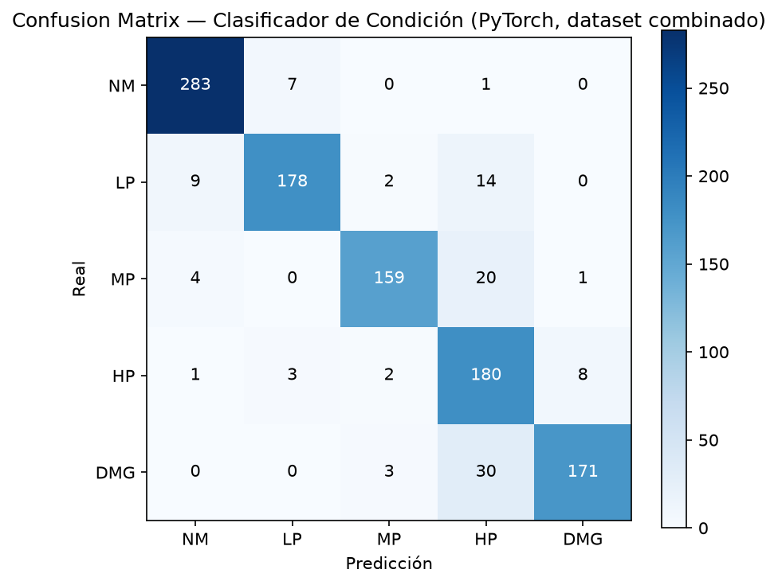
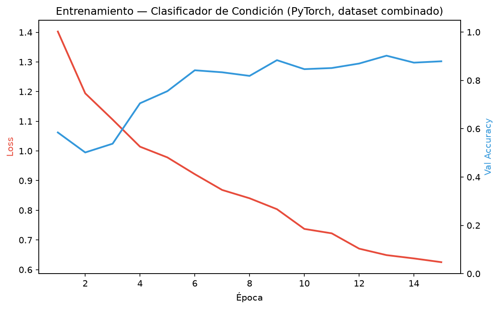
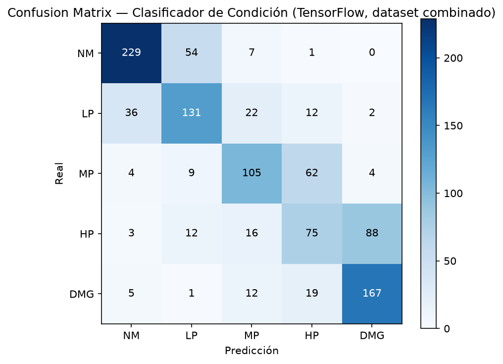
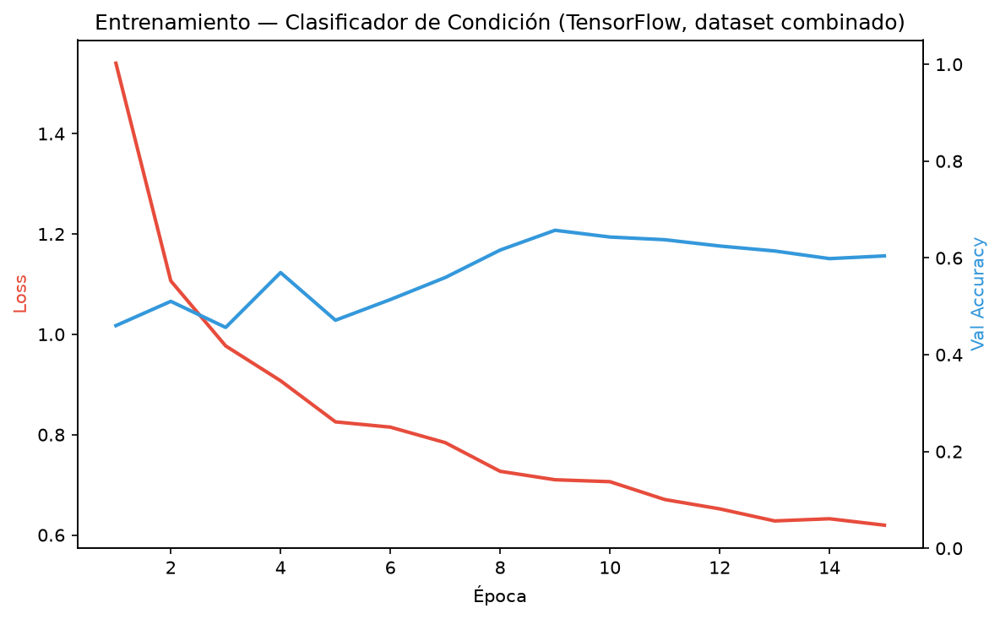
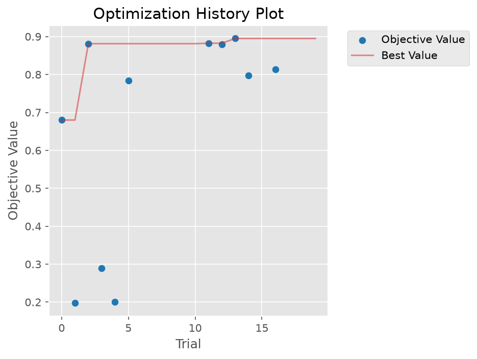
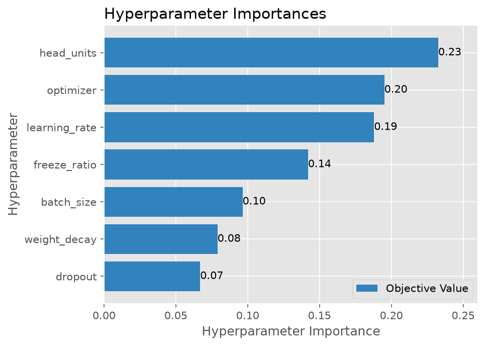

**Qué concluir de la matriz de confusión combinada**: los errores no son
uniformes — se concentran entre grados **adyacentes** (ej. LP confundido
con MP, HP confundido con MP/DMG), casi nunca entre extremos (NM
confundido con DMG). Esto es coherente con la naturaleza del problema: la
diferencia visual entre NM y LP es sutil (un pequeño rayón), mientras que
NM vs. DMG es obvia — el modelo comete errores "razonables", no
aleatorios. TensorFlow es sistemáticamente más débil en **todos** los
grados, y particularmente en HP (F1=0.413, el peor número de las 4
etapas) — la brecha entre frameworks en esta etapa (0.217 F1-macro) es la
más grande del proyecto, a diferencia de Etapas 1-3 donde ambos
frameworks quedan cerca o empatan.

**Estado de la aumentación con fundas ("sleeves")**: existe un script
(`synthetic_sleeve.py`) que simula brillos especulares, tinte de color y
anillo de borde coloreado como si la carta estuviera dentro de una funda
protectora, integrado opcionalmente (`--con-fundas`) en la preparación del
dataset — pero **ningún checkpoint entrenado hasta ahora usó datos con
fundas** (queda como trabajo futuro documentado, no una limitación oculta).

### 2.3 Etapa 2 — Validador de texto (¿el OCR coincide con la carta?)

**Tipo de problema**: clasificación binaria sobre un **par** de textos —
no clasifica una imagen, clasifica si dos strings (texto OCR de la foto,
texto de referencia de la carta candidata) describen la misma carta.

**Por qué existe esta etapa**: la Etapa 1 identifica una carta *candidata*
por similitud visual (embedding), pero cartas con la misma ilustración
pueden tener ediciones/reimpresiones distintas, y fotos de baja calidad
pueden confundir al retrieval visual — el texto impreso (nombre + reglas)
es una señal independiente y más discriminativa para confirmar la
identidad exacta.

**Pipeline de features — arquitectura tipo "matching network"**:

```
v_ocr = HashingVectorizer(texto_ocr)        # 512-d
v_ref = HashingVectorizer(texto_referencia)  # 512-d
x = concat[v_ocr, v_ref, |v_ocr - v_ref|, v_ocr * v_ref]   # 2048-d
```

La resta capta divergencia léxica; el producto elemento-a-elemento capta
qué n-gramas aparecen en *ambos* textos a la vez — mismo patrón conceptual
que redes de matching de oraciones tipo ESIM/InferSent, adaptado a
n-gramas hasheados en vez de embeddings de palabras.

**Arquitectura `TextMatcher`** (idéntica estructuralmente en ambos
frameworks):

```
Linear(2048, 256) → ReLU → Dropout(0.3)
Linear(256, 128)  → ReLU → Dropout(0.3)
Linear(128, 1)                            # logit crudo
```

Pérdida `BCEWithLogitsLoss`. `EPOCHS=20`, `BATCH_SIZE=64`, split
80/20 **por `card_id`** (cada carta aporta 2 pares que comparten el mismo
`ocr_text` — split por fila filtraría el mismo texto a train y val).

**Búsqueda de Optuna** — mismo espacio que Etapa 1 sin `freeze_ratio`
(no hay backbone congelado acá, es una MLP entera). Ganadores:

| Param | PyTorch | TensorFlow |
|---|---|---|
| learning_rate | 2.07e-3 | 1.31e-3 |
| weight_decay | 6.24e-6 | 1.84e-5 |
| hidden_units | 384 | 192 |
| dropout | 0.4 | 0.3 |
| optimizer | adamw | adam |

**Métricas finales** (785 cartas OCR'eadas → 1,570 pares, 314 de
validación):

| Modelo | ROC-AUC | Umbral Youden | Accuracy @ umbral | F1 @ umbral |
|---|---|---|---|---|
| Baseline (solo OCR+difflib, sin red entrenada) | 0.818 | 0.395 | 0.823 | — |
| PyTorch — plano | 0.9872 | 0.199 | 0.9618 | 0.9615 |
| **PyTorch — Optuna** | **0.9906** | 0.123 | 0.9618 | 0.9610 |
| TensorFlow — plano | 0.9861 | 0.531 | 0.9490 | 0.9470 |
| **TensorFlow — Optuna** | **0.9886** | 0.085 | 0.9618 | 0.9613 |

Diferencia final PyTorch vs TensorFlow: 0.0020 ROC-AUC → **empate**
(bajo el umbral de 0.005).

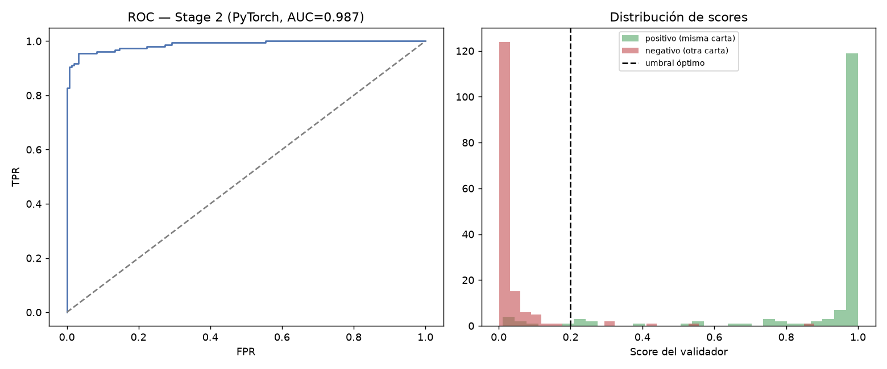
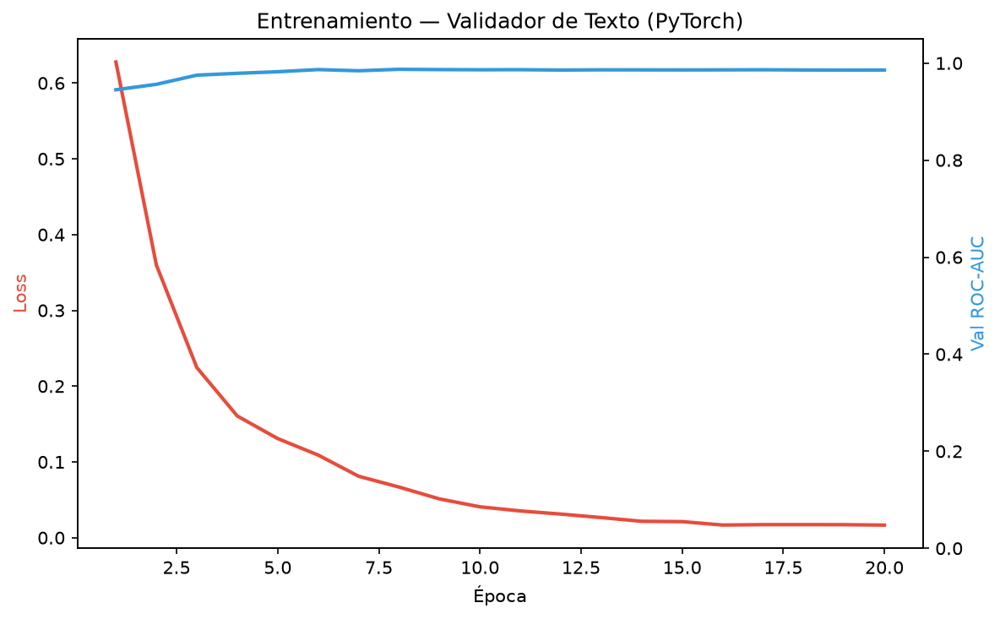
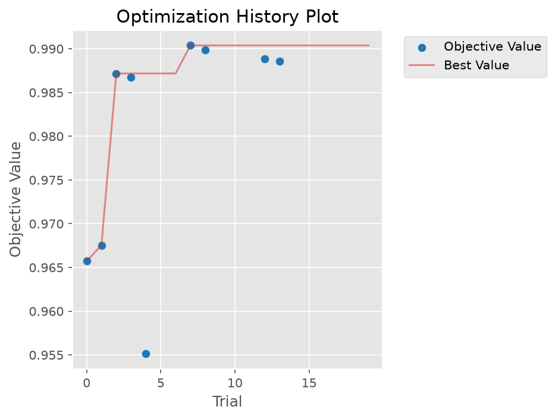
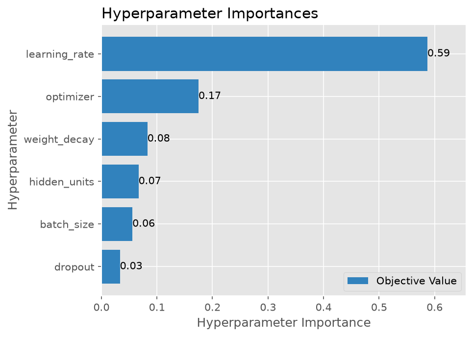
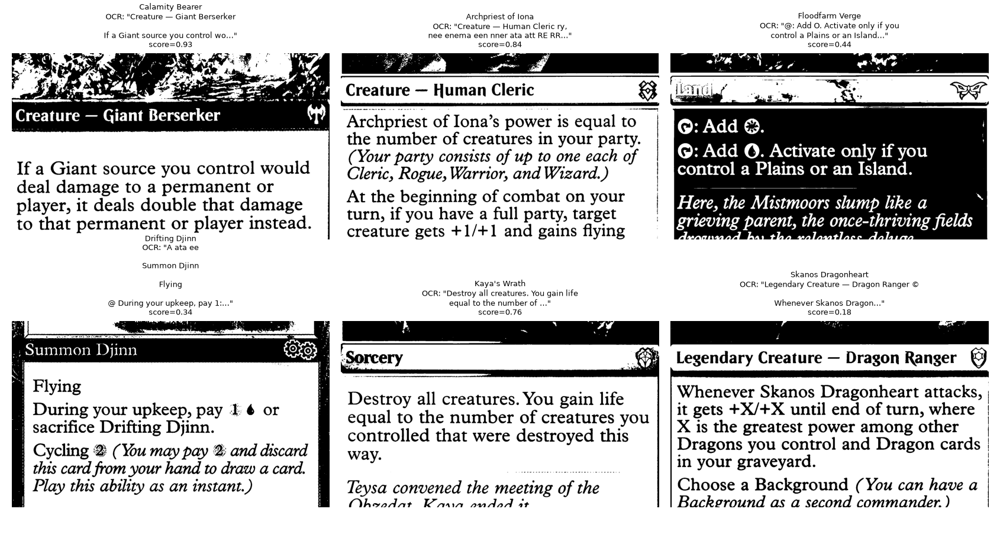
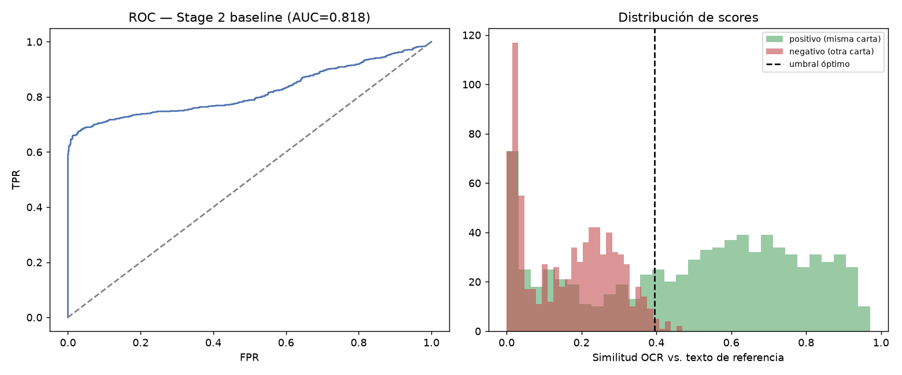

**Qué concluir**: el gráfico de "distribución de scores" (histograma de la
salida del modelo separado en pares positivos vs. negativos) debería
mostrar dos campanas bien separadas con poco solape — consistente con un
ROC-AUC de ~0.99 (casi perfecto). El **baseline** (0.818 AUC, sin ningún
parámetro entrenado, solo OCR + `difflib.SequenceMatcher`) ya es un punto
de referencia sólido — confirma que la señal (comparar texto OCR contra
texto de referencia) es genuinamente informativa *antes* de invertir en
una red entrenada; el salto de 0.818 a 0.99 cuantifica cuánto aporta
específicamente aprender a ponderar qué diferencias de texto importan más
(la MLP entrenada aprende, por ejemplo, a tolerar mejor errores típicos de
OCR que `difflib` penaliza por igual que un error real). Nótese que el
umbral óptimo de Youden es **distinto** en cada modelo (0.123 a 0.531) —
justamente por eso no se puede asumir 0.5 como umbral fijo y hay que
calcularlo por modelo.

### 2.4 Etapa 3 — Estimador de precio (regresión)

**Tipo de problema**: regresión, combinando **features tabulares** +
**embedding visual congelado** (transfer learning tipo feature-extraction,
reusando el backbone ya afinado de la Etapa 1 — no ImageNet crudo).

**Vector de entrada — `x = concat(x_tab, x_vis)`**

`x_tab` (50 dimensiones, byte-idénticas entre frameworks):
- 11 campos numéricos/binarios: `cmc`, `n_colores`, `es_incoloro`,
  `es_legendaria`, `n_frame_effects`, `tiene_foil`, `tiene_etched`, `anio`,
  `antiguedad_anios`, `edhrec_rank_conocido` (flag), `edhrec_rank_log`.
- 15 dimensiones one-hot fijas (5 colores + 10 tipos primarios).
- 24 dimensiones one-hot con vocabulario fijo + bucket "other": rareza (7),
  `set_type` (6), `frame` (6), `border_color` (5).
- Los 6 campos numéricos no acotados se estandarizan (media/std calculados
  **una vez** sobre train y persistidos en un JSON plano, no un objeto
  `StandardScaler` — portable entre Python/TypeScript sin re-implementar
  sklearn).

`x_vis` (embedding visual, congelado, del backbone de la Etapa 1 ya
afinado — no ImageNet genérico):
- PyTorch (EfficientNet-B0): **1280 dimensiones**.
- TensorFlow (MobileNetV3Small): **576 dimensiones**.
- Precomputado una sola vez por carta y cacheado en disco (el backbone es
  determinístico y no cambia durante el entrenamiento de la Etapa 3 — no
  tiene sentido recalcularlo cada época).

`input_dim` final: **1330 (PyTorch)** vs. **626 (TensorFlow)** — distinto
entre frameworks por diseño, ya que cada backbone produce un embedding de
tamaño distinto; es la misma situación que en la Etapa 1/4.

**Target**: `log1p(prices.usd)` (ver §1.8 sobre por qué log-space).

**Arquitectura `PriceRegressor`** (misma forma que `TextMatcher`, cabeza de
regresión):

```
Linear(input_dim, 256) → ReLU → Dropout(0.3)
Linear(256, 128)        → ReLU → Dropout(0.3)
Linear(128, 1)                                  # log1p(precio) predicho, sin activación
```

Pérdida `MSELoss` sobre `log1p(precio)`. `EPOCHS=40`, `BATCH_SIZE=64`,
split fijo por `card_id` compartido entre frameworks (mismas cartas
exactas en train/val/test para ambos, no solo mismo tamaño de split).

**El hallazgo central de esta etapa — el "techo de información" y su
arreglo (`edhrec_rank`)**:

1. Con las 48 dimensiones tabulares originales (sin `edhrec_rank`), un
   sweep de Optuna de 20 trials se estancó en **R²(log)=0.430-0.441** en
   ambos frameworks, **sin importar los hiperparámetros probados**,
   mientras el train loss seguía bajando — la firma clásica de un techo de
   *información disponible*, no un problema de tuning: el conjunto de
   features no distinguía una carta común de $0.10 de una carta "chase" de
   $40 que comparten las mismas columnas categóricas (rareza, tipo, set).
2. El precio de una carta de Magic está fuertemente correlacionado con su
   **demanda competitiva** (cuánto se juega), señal que no estaba
   representada en absoluto. Se agregó `edhrec_rank` (ranking de
   popularidad de EDHREC — más bajo = más jugada) desde el dump ya cacheado
   de Scryfall, sin necesitar una nueva llamada de red.
3. Con la feature nueva (50 dims), re-entrenando en el dataset completo
   (51,939 cartas con precio): **R²(log) salta a 0.648-0.658** — una
   ganancia de +0.21/+0.22 puntos, la mayor mejora medida en todo el
   proyecto por un solo cambio de features.
4. Después de este cambio, el aporte de Optuna se vuelve casi marginal
   (+0.007 PyTorch, +0.001 TensorFlow) — confirma que el cuello de botella
   era la feature faltante, no los hiperparámetros.

**Métricas finales — dataset completo (51,939 cartas con precio, split
36,359/7,790/7,790 por `card_id`)**

| Modelo | MAE (log) | RMSE (log) | **R² (log)** | MAE (USD) | Median AE (USD) | R² (USD) |
|---|---|---|---|---|---|---|
| Baseline tabular (Random Forest, sin imagen) | 0.317 | 0.531 | **0.521** | $2.59 | $0.20 | 0.191 |
| PyTorch — plano | 0.261 | 0.462 | **0.651** | $2.86 | $0.16 | 0.135 |
| **PyTorch — Optuna** | 0.249 | 0.457 | **0.658** | $2.77 | $0.12 | 0.176 |
| TensorFlow — plano | 0.254 | 0.464 | **0.648** | $2.89 | $0.14 | 0.028 |
| **TensorFlow — Optuna** | 0.240 | 0.463 | **0.649** | $2.89 | $0.11 | 0.025 |

Diferencia final PyTorch vs TensorFlow: R²(log) 0.6585 vs 0.6491 = 0.0094
→ **por encima** del umbral de empate (0.005) → **gana PyTorch** (a
diferencia de la Etapa 2, que empató).

**Hiperparámetros ganadores (Optuna)**: PyTorch `lr=2.73e-4,
weight_decay=1.07e-4, hidden_units=448, dropout=0.0, optimizer=adam`;
TensorFlow `lr=2.73e-4, weight_decay=7.15e-5, hidden_units=384,
dropout=0.3, optimizer=adam`.

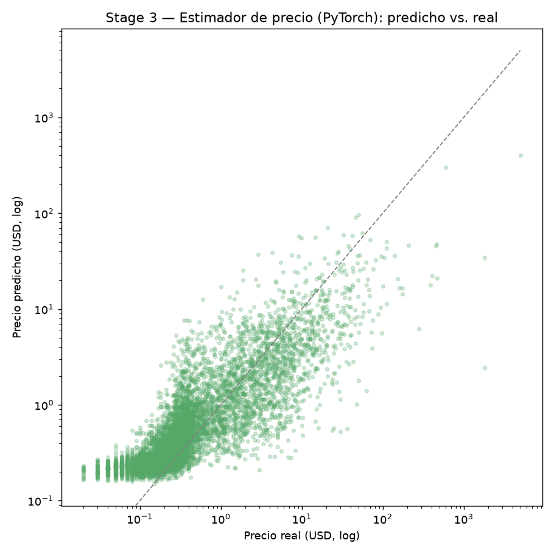
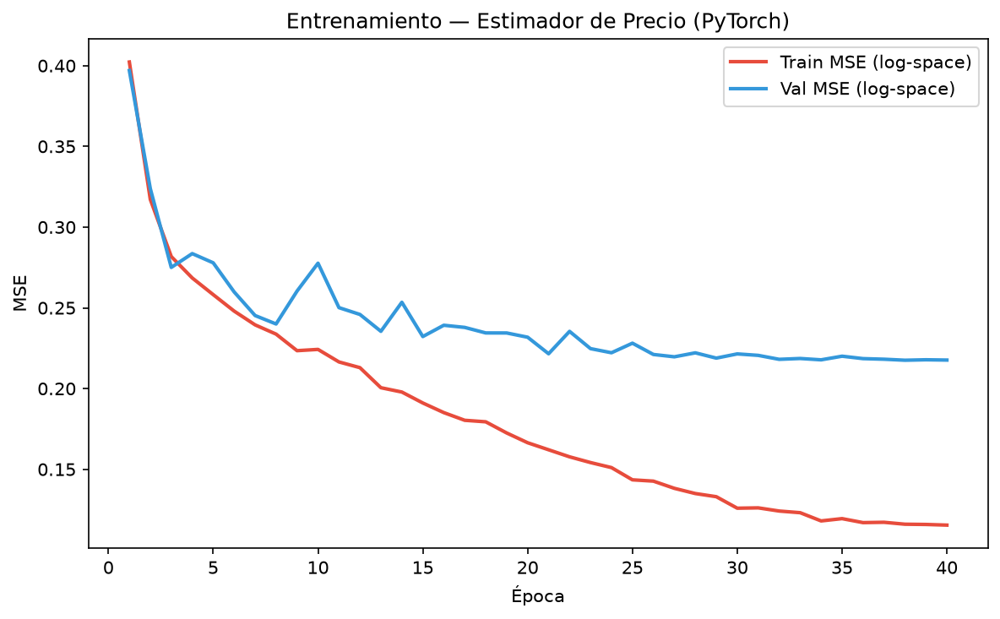
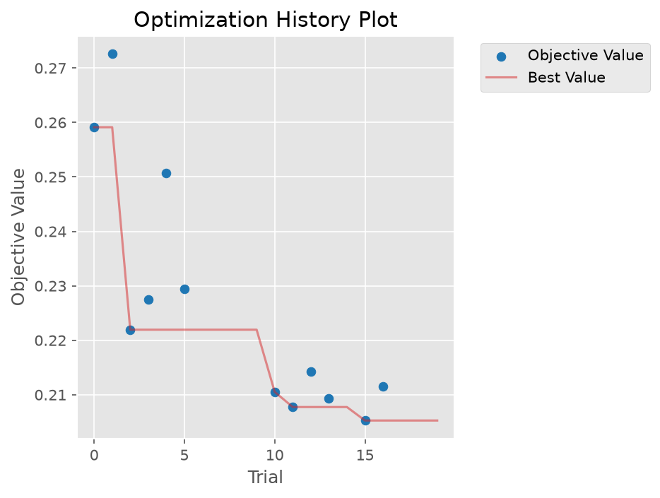
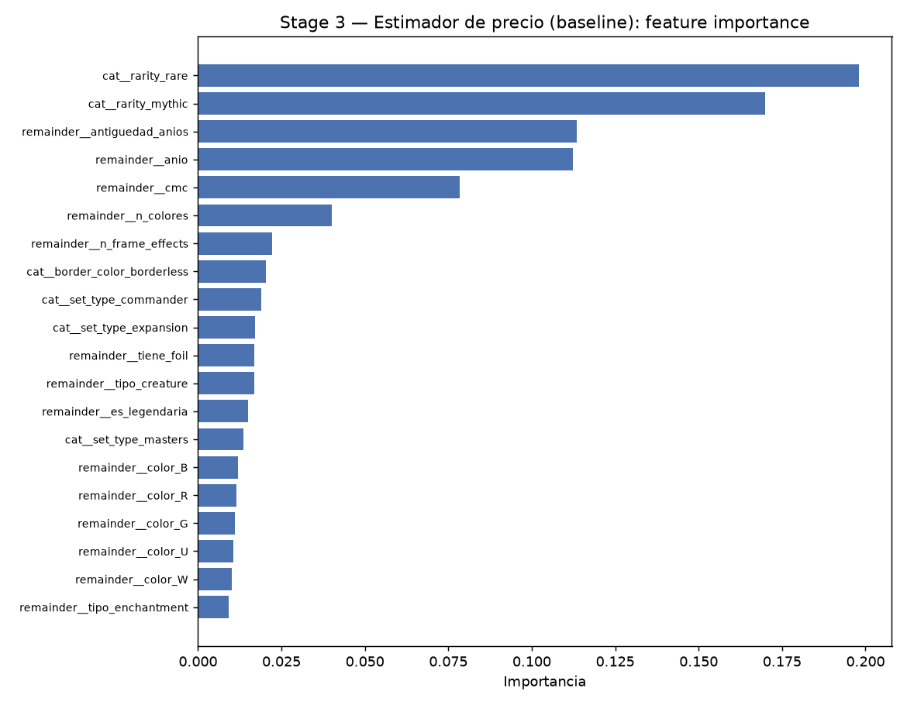
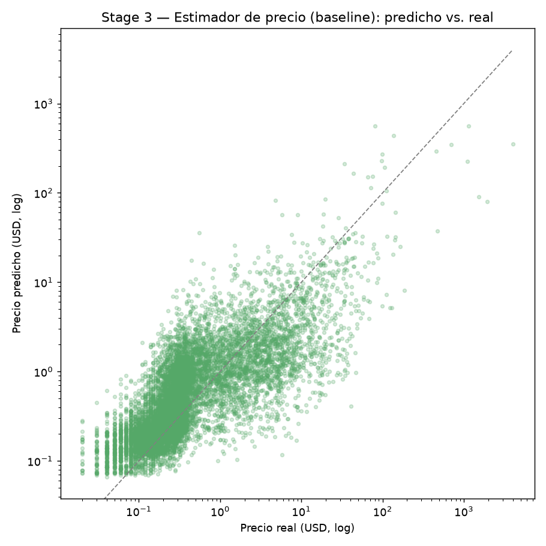

**Qué concluir del gráfico "predicción vs. real"**: los puntos deberían
agruparse cerca de la diagonal `y=x` para precios bajos (la mayoría de la
masa de datos) y dispersarse más a medida que el precio real sube — visual
directo del mismo fenómeno explicado en §1.8 (el modelo es bueno en la
masa común, menos preciso en los outliers caros). El gráfico de
**importancia de features del baseline Random Forest** (previo al fix de
`edhrec_rank`) muestra `rareza` (rara/mítica), la antigüedad/año y el
`cmc` como señales dominantes — consistente con la intuición de mercado de
MTG (cartas raras/míticas y de sets antiguos valen más), y ayuda a
entender *por qué* faltaba una señal de demanda: ninguna de esas features
captura "qué tan jugada es esta carta competitivamente", que es
justamente lo que `edhrec_rank` aporta.

**Baseline (sklearn, sin red neuronal, sin imagen)**: `RandomForestRegressor`
(200 árboles, `max_depth=18`, `min_samples_leaf=3`) sobre un
`ColumnTransformer` con one-hot ajustado (`OneHotEncoder` real, a
diferencia del vocabulario fijo de la versión "de verdad" — acá sí tiene
sentido porque es un modelo sklearn independiente, no hay que sincronizar
nada entre frameworks). **Nota de tuning documentada**: la versión inicial
sin límite de profundidad (300 árboles, `max_depth=None`) pesaba ~800MB y
memorizaba filas individuales sin mejorar R² — limitar la profundidad
subió R²(log) de 0.454 a 0.521 y bajó el tamaño a ~90MB — ejemplo concreto
de que "más capacidad" no es "mejor modelo" cuando hay overfitting.

### 2.5 Tabla comparativa final — resumen de las 4 etapas

| Etapa | Métrica principal | PyTorch | TensorFlow | Diferencia | Ganador |
|---|---|---|---|---|---|
| 1 — Detector (binario) | Accuracy | 1.0000 | 1.0000 | 0.0000 | Empate |
| 1 — Retrieval (58,679 clases) | Top-1 | 0.2528 | 0.2435 | 0.0093 | PyTorch (margen chico) |
| 2 — Validador de texto | ROC-AUC | 0.9906 | 0.9886 | 0.0020 | Empate |
| 3 — Estimador de precio | R² (log-USD) | 0.6585 | 0.6491 | 0.0094 | PyTorch |
| 4 — Clasificador de condición | F1 macro | 0.9523 | 0.7546 | 0.1977 | PyTorch (margen grande) |

**Conclusión general del proyecto**: PyTorch nunca pierde una etapa
outright; empata en 2 (donde la tarea es o muy fácil — Etapa 1 binaria — o
ambos frameworks ya son muy buenos — Etapa 2), y gana con margen chico en
la etapa de regresión (Etapa 3). La única brecha realmente grande está en
la Etapa 4 (clasificador de condición, ~0.20 F1-macro), que además es la
única etapa con datos reales limitados (1,184 fotos) mezclados con
sintéticos — sugiere que, en este proyecto puntual, la implementación
TensorFlow generaliza peor cuando el dataset es chico y heterogéneo
(real+sintético), no que TensorFlow sea inherentemente inferior como
framework.

---

## PARTE 3 — Preprocesamiento de imágenes y datos sintéticos (OpenCV)

Todo esto vive principalmente en `card_preprocessing.py` (localización de
la carta) y `synthetic_wear.py`/`synthetic_sleeve.py` (generación de datos
sintéticos), con una réplica del pipeline de localización portada a
TypeScript/OpenCV.js para correr client-side en la app Ionic.

### 3.1 Localización y normalización de la carta (`normalizar_carta`)

Objetivo: dada una foto donde la carta puede estar en cualquier ángulo,
tamaño y con fondo variable, recortarla y corregirla a un rectángulo
canónico de 750×1050px, listo para OCR/clasificación.

Pasos encadenados:

1. **Doble segmentación por color, brillo Y saturación** — no solo una:
   - Máscara por brillo: escala de grises + blur gaussiano + Otsu.
   - Máscara por saturación (canal S de HSV) + Otsu **invertido** (el
     contenido de la carta suele tener *menos* saturación que un fondo de
     color sólido, ej. una toalla roja).
   - **Medido sobre 122 fotos reales**: brillo-Otsu solo funcionó en 37/122
     (30%); saturación-Otsu solo funcionó en 122/122 (100%). Conclusión
     práctica: depender solo de brillo fallaba sistemáticamente cuando el
     fondo era oscuro pero saturado — un hallazgo real de debugging, no
     una decisión de diseño a priori.
2. **Detección de contornos + filtrado geométrico**: área relativa
   (0.15-0.75 del cuadro), relación de aspecto cercana a 63:88mm (la
   proporción real de una carta MTG), desviación estándar mínima de gris
   (rechaza superficies uniformes tipo mousepad), penalización blanda si
   toca el borde del cuadro.
3. **Descarte de contornos anidados**: si un candidato está completamente
   contenido dentro de otro candidato más grande, se descarta — evita
   matchear una caja de texto interior en vez de la carta completa.
4. **Rechazo de piel humana**: rango clásico YCrCb de tono de piel,
   combinado **obligatoriamente** con baja densidad de bordes Canny —
   solo color no bastaba (una carta real, "Sol Ring", medía 66-72% dentro
   del rango de piel por su arte cálido/gris y casi se rechazaba por
   error; exigir también baja densidad de bordes lo arregló).
5. **Ajuste de esquinas reales (no solo rectángulo)**:
   `cv2.approxPolyDP` sobre el contorno para obtener un cuadrilátero real
   de 4 puntos (no forzado a rectángulo), con fallback a
   `minAreaRect`/`boxPoints` si el contorno no se reduce limpio — maneja
   el "efecto trapecio" de fotos tomadas en ángulo.
6. **Corrección de perspectiva**: `getPerspectiveTransform` +
   `warpPerspective` al tamaño canónico.
7. **Fallback**: si no hay contorno confiable, se hace un simple `resize`
   de la imagen completa — el pipeline nunca "rompe"/devuelve `None`.

### 3.2 Heurísticas de calidad sobre la carta ya normalizada

- **Detección de brillo especular** (glare, típico de fundas plásticas):
  máscara HSV de alto-Valor + baja-Saturación, umbral 3% del área.
- **Detección de funda opaca / sin contenido reconocible**: densidad de
  bordes Canny **y** desviación estándar de gris ambas muy bajas
  simultáneamente = "no hay contenido de carta reconocible" (0 falsos
  positivos medidos en 122 fotos reales).
- **Detección de blur**: varianza del Laplaciano, umbral 15.0 (fotos
  nítidas midieron ~75-130, fotos artificialmente desenfocadas ~2-2.5).
- **CLAHE**: sobre el canal L (luminosidad) del espacio Lab, `clipLimit=2.0`,
  `tileGridSize=(8,8)` — normaliza iluminación despareja antes de OCR.
- **Medición de inclinación/keystoning**: razón entre lados opuestos
  (arriba/abajo, izquierda/derecha) del cuadrilátero detectado — estima
  el desalineamiento cámara-carta sin necesitar sensores de movimiento
  (una alternativa basada en el giroscopio del teléfono fue evaluada y
  descartada a favor de este método puramente geométrico).

### 3.3 Generación de desgaste sintético (`synthetic_wear.py`)

5 efectos de OpenCV compuestos, con intensidad ajustada a mano por grado
(NM/LP/MP/HP/DMG) — parametrizados manualmente, no aprendidos:

1. **Blanqueo de bordes** (`_whitening_bordes`): máscara rectangular
   irregular + ruido + blur gaussiano, mezclada por alpha-blending.
2. **Rayones** (`_scratches`): líneas aleatorias mezcladas con
   `cv2.addWeighted`.
3. **Redondeo de esquinas** (`_redondear_esquinas`): máscaras circulares
   de recorte mezcladas hacia un color de "fondo" más claro.
4. **Pliegues/creases**: banda de sombra diagonal (línea + blur gaussiano),
   restada como intensidad.
5. **Manchas**: blobs circulares desenfocados, mezclados por alpha.

### 3.4 Simulación de funda protectora (`synthetic_sleeve.py`)

Composición de brillos especulares, tinte de color uniforme, anillo de
borde coloreado (solo fundas de color) y ligero blur gaussiano — mismo
patrón arquitectónico que `synthetic_wear.py`. Está integrada
(`--con-fundas`) en la preparación del dataset de la Etapa 4, pero **aún
no se usó en ningún entrenamiento real** (trabajo futuro documentado).

---

## PARTE 4 — Arquitectura de la app (MTG Companion) y servicios usados

La app comercial construida sobre el pipeline de ML tiene tres piezas:
`apps/mobile/` (frontend móvil), `backend/` (API), `desktop-runner/`
(herramienta de escritorio para correr el pipeline de entrenamiento).

### 4.1 Frontend — Ionic + React + Capacitor

**Stack**: Ionic React 8, React 19, Capacitor 8 (solo target Android),
Vite, `onnxruntime-web` (inferencia), `tesseract.js` (OCR), `@techstark/opencv-js`
(OpenCV compilado a WebAssembly).

**Cómo corren los 4 modelos on-device** — cada etapa tiene su propio
módulo TypeScript (`src/lib/ml/*.ts`) que carga el `.onnx` correspondiente
vía `onnxruntime-web` y reconstruye a mano el preprocesamiento exacto que
el modelo espera:

- **Detalle no trivial y con un bug real documentado**: el modelo de la
  Etapa 1 (exportado desde TensorFlow/Keras) espera entrada **NHWC**
  (canales al final, `[1,224,224,3]`) y **sin normalización ImageNet**
  (la capa `Rescaling` de Keras ya viene incluida dentro del grafo
  exportado) — mientras que los modelos de las Etapas 3 y 4 (exportados
  desde PyTorch) esperan **NCHW** (`[1,3,224,224]`) **con** normalización
  ImageNet explícita (`mean=[0.485,0.456,0.406]`, `std=[0.229,0.224,0.225]`).
  Confundir estas dos convenciones causó un bug real en producción (la
  Etapa 1 lanzaba una excepción de dimensión y el código, mal diseñado,
  "fallaba abierto" — aceptaba cualquier captura como válida en vez de
  rechazarla). Es un ejemplo concreto de por qué verificar el contrato
  exacto de un grafo ONNX (no asumirlo) importa.
- **`hashingVectorizer.ts`**: puerto desde cero, bit-idéntico, del
  `HashingVectorizer` de sklearn en TypeScript — implementa MurmurHash3
  a mano y la tokenización `char_wb` exacta de sklearn (incluyendo un
  detalle fácil de pasar por alto: sklearn deja de intentar n-gramas más
  grandes en cuanto una palabra es más corta que `n`). Verificado
  comparando salida contra sklearn real en casos con acentos, puntuación,
  espacios múltiples y string vacío.
- **`ocrExtractor.ts`**: recorta la caja de texto/nombre de la carta ya
  normalizada, aplica CLAHE (vía OpenCV.js), escala de grises, Otsu
  (implementado a mano en TS, fiel al algoritmo de `cv2.threshold`), y
  pasa el resultado a `tesseract.js`. Los assets de Tesseract (worker,
  WASM, datos de idioma inglés) se auto-hospedan en `public/` en vez de
  depender del CDN por defecto (jsdelivr), para no requerir red en cada
  uso.

### 4.2 ONNX Runtime — motor de inferencia

**ONNX Runtime** es el motor que ejecuta los grafos `.onnx` exportados.
Existen dos variantes relevantes acá:

- **`onnxruntime-web`**: corre inferencia dentro del navegador/WebView vía
  WebAssembly — es lo que usa la app Ionic para inferencia 100%
  *on-device* (sin mandar la foto a ningún servidor). Ventaja: privacidad
  y funciona offline; costo: más lento que un binding nativo y limitado
  por el hardware del teléfono.
- **`onnxruntime-node`**: binding nativo (no WASM) para Node.js — usado en
  este proyecto solo para *verificación* (comparar la salida del modelo
  ONNX contra la salida real de PyTorch/TensorFlow en Python, para
  confirmar paridad numérica), no en producción.

### 4.3 Backend — NestJS + Prisma + PostgreSQL

- **NestJS**: framework de backend en TypeScript, construido sobre
  Express, con arquitectura modular obligatoria (inspirada en Angular):
  módulos, controladores (rutas HTTP), providers/servicios (lógica de
  negocio), inyección de dependencias en todo el framework. Trae
  integración de primera clase para config, autenticación JWT/Passport,
  WebSockets, validación de DTOs, etc.
- **Prisma**: ORM de TypeScript. El modelo de datos se declara en un
  archivo `schema.prisma`; Prisma genera un cliente completamente tipado
  a partir de él, más un sistema de migraciones versionadas
  (`prisma migrate`) que traduce cambios de schema a SQL real.
- **PostgreSQL**: base de datos relacional (SQL), ACID, el almacén
  principal de usuarios/cartas/transacciones.

**Modelo de datos principal** (`schema.prisma`): `User`, `UserSettings`
(1-a-1, incluye preferencias de 2FA/idioma/ubicación), `RefreshToken`
(hash SHA-256, no el token en claro — rotado en cada uso), `Card` (una
carta física que un usuario posee/vende), `CardPhoto`, `CatalogCard`
(catálogo de solo lectura, ~58,679 filas de Scryfall, usado por la Etapa 3
del lado cliente para construir las features tabulares al momento de
escanear), `Transaction` (compra/venta, con estado
`PENDING/PAID/CANCELLED/FAILED` y método de pago `MERCADOPAGO/CASH`).

### 4.4 Servicios de infraestructura (dev, vía Docker Compose)

- **Docker**: empaqueta una aplicación con sus dependencias exactas en una
  imagen portable, corrida como contenedor aislado que comparte el kernel
  del host (más liviano que una VM completa). `docker-compose` orquesta
  varios contenedores relacionados como una unidad.
- **PostgreSQL** (contenedor `postgres:16-alpine`): la base de datos, como
  arriba.
- **MinIO**: almacenamiento de objetos self-hosted que implementa la
  misma API HTTP que Amazon S3 — permite correr un stack "compatible con
  S3" enteramente local/offline en desarrollo, y apuntar exactamente el
  mismo código cliente a un S3 real en producción cambiando solo endpoint
  y credenciales. Se usa acá para las fotos de las cartas (`CardPhoto`).
- **MailHog**: servidor SMTP desechable para desarrollo — captura
  cualquier correo saliente de la app (bienvenida, recibos) sin enviarlo
  de verdad, y lo muestra en una UI web — permite verificar el contenido
  y el disparo de los correos sin credenciales SMTP reales ni spamear
  bandejas de entrada reales.

### 4.5 `desktop-runner` — GUI de escritorio para correr el pipeline

**Electron**: framework para apps de escritorio multiplataforma con
tecnologías web — embebe Chromium (para la interfaz) y Node.js (para
acceso al sistema operativo) en un modelo de proceso "main" (con acceso
completo a Node, controla el ciclo de vida y APIs nativas) + procesos
"renderer" (la interfaz, normalmente aislados de Node por seguridad,
`contextIsolation: true`).

En este proyecto: el proceso Electron levanta un servidor **NestJS
embebido** que expone una API para listar/correr cada script de
entrenamiento (`scripts.config.ts` es la fuente única de verdad de qué
scripts existen y con qué argumentos), gestiona los entornos virtuales de
Python de cada framework, transmite logs en vivo vía **WebSockets**
(Socket.IO) al renderer React, y decide automáticamente si usar GPU
(CUDA/ROCm) o CPU según el hardware detectado. El renderer visualiza
resultados de Optuna y métricas de entrenamiento con gráficos (Recharts).

### 4.6 Glosario rápido de servicios/tecnologías (para preguntas sueltas)

| Tecnología | Qué es, en una frase |
|---|---|
| **PostgreSQL** | Base de datos relacional (SQL), transaccional (ACID) |
| **MinIO** | Almacenamiento de objetos self-hosted, compatible con la API de Amazon S3 |
| **MailHog** | Servidor SMTP de mentira para desarrollo — atrapa correos sin enviarlos |
| **Docker / Docker Compose** | Empaquetado y orquestación de aplicaciones en contenedores aislados |
| **Prisma** | ORM tipado para TypeScript, con migraciones de schema versionadas |
| **NestJS** | Framework de backend en TypeScript, modular, sobre Express |
| **Electron** | Apps de escritorio con tecnologías web (Chromium + Node.js) |
| **Ionic + Capacitor** | UI móvil con web tech (Ionic) + puente a APIs nativas Android/iOS (Capacitor) |
| **ONNX** | Formato estándar abierto para intercambiar modelos entrenados entre frameworks |
| **ONNX Runtime (web/node)** | Motor de inferencia para grafos ONNX, en navegador (WASM) o en Node (nativo) |
| **Optuna** | Framework de optimización de hiperparámetros vía muestreo bayesiano (TPE) + poda de trials |
| **HashingVectorizer** | Vectorización de texto determinística vía hashing (murmurhash), sin vocabulario ajustado |
| **Tesseract** | Motor OCR clásico, con un modelo LSTM interno para reconocimiento de caracteres |
| **OpenCV** | Librería de visión por computador clásica (segmentación, contornos, transformadas geométricas) |

---

## PARTE 5 — Glosario rápido

- **Backbone**: la parte de una red (usualmente convolucional) que
  extrae features/embeddings de una entrada, reusada entre tareas.
- **Cabeza (head)**: las capas finales, específicas de la tarea, que se
  agregan sobre un backbone (acá, siempre una MLP chica).
- **Embedding**: representación vectorial de tamaño fijo de una entrada
  (imagen o texto), pensada para que entradas "similares" queden cerca en
  ese espacio vectorial.
- **Época (epoch)**: una pasada completa por todo el set de entrenamiento.
- **Batch / batch size**: cuántos ejemplos se procesan juntos antes de
  actualizar los pesos una vez.
- **Logit**: la salida cruda de una red antes de aplicar sigmoide/softmax
  — puede ser cualquier número real, no está en `[0,1]`.
- **Checkpoint**: una copia guardada de los pesos del modelo en un punto
  del entrenamiento (normalmente el que mejor rindió en validación).
- **Softmax**: convierte un vector de logits en una distribución de
  probabilidad (suma 1) sobre múltiples clases — la generalización de la
  sigmoide a más de 2 clases.
- **Sigmoide**: `1/(1+e^-x)`, aplasta un logit a `(0,1)`, usada para
  probabilidad binaria.
- **Normalización (de imagen)**: restar la media y dividir por la
  desviación estándar (por canal) — pone los valores de píxel en un rango
  numérico estable para entrenar; los valores típicos de ImageNet
  (`mean=[0.485,0.456,0.406]`, `std=[0.229,0.224,0.225]`) se usan cuando el
  backbone fue preentrenado en ImageNet con esa normalización.
- **Semilla (seed)**: número fijo que inicializa los generadores
  aleatorios — garantiza reproducibilidad (mismo split, misma
  inicialización de pesos, mismo orden de datos) entre corridas.
